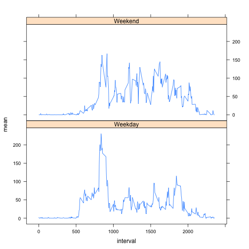

# Reproducible Research: Peer Assessment 1


## Loading and preprocessing the data
Load the data from the .csv file provided. 
Transform date column to date type for processing


```r
data <- read.csv("activity.csv")
data$date <- as.Date(data$date)
```

## What is mean total number of steps taken per day?
Draw the histogram of the total number of steps taken each day.
Also, calculate the mean and median total number of steps taken per day

```r
totalByDate <- tapply(data$steps, data$date, sum, na.rm=TRUE)
hist(totalByDate,ylab ="Number of days", xlab="number of steps", main="Steps and Days")
```

 

```r
mean(totalByDate)
```

```
## [1] 9354
```

```r
median(totalByDate)
```

```
## [1] 10395
```

## What is the average daily activity pattern?

Drow a time series plot of the 5-minute interval and the average number of steps taken
Also finds the 5-minute interval with the maximum number of steps.

```r
byInterval <- tapply(data$steps, data$interval, mean, na.rm=TRUE)
byIntervalM <- data.frame(as.numeric(names(byInterval)), byInterval)
plot(byIntervalM[,1], byIntervalM[,2], type = "l", main="Average Daily Activity Pattern", xlab="interval", ylab="steps (averaged)")
```

 

```r
# Max number of steps in interval :
byIntervalM[which.max(byIntervalM[,2]),][1,1]
```

```
## [1] 835
```


## Imputing missing values
* Calculate and report the total number of missing values.
* Devise a strategy for filling in all of the missing values. They are folled based on the mean for that 5-minute interval.
* Create a new dataset that is equal to the original dataset but with the missing data filled in
* Drow the histogram and calculate and report the mean and median total number of steps taken per day

These values are different to previous histogram, mean and median values. THis is due to replacing 'NA's with the positive value (mean).


```r
missing <- is.na(data$steps)
sum(missing)
```

```
## [1] 2304
```

```r
dataFilled <- data
missing2  <- which(is.na(data$steps), arr.ind=TRUE)
for (i in missing2) {
  dataFilled[i,1] <- byInterval[as.character(dataFilled[i,3])]
}

totalByDate2 <- tapply(dataFilled$steps, dataFilled$date, sum, na.rm=TRUE)
hist(totalByDate2,ylab ="Number of days", xlab="number of steps", main="Steps and Days")
```

 

```r
mean(totalByDate2)
```

```
## [1] 10766
```

```r
median(totalByDate2)
```

```
## [1] 10766
```

## Are there differences in activity patterns between weekdays and weekends?

Create a new factor variable named 'dayType'  with two levels – “weekday” and “weekend” 
Drow a panel plot containing a time series plot for both 'weekday' and weekend'

```r
library(lattice) 

day <- weekdays(dataFilled[,2])
dayType <- day
dayType[day != "Sunday" & day != "Saturday"] <- "weekday"
dayType[day == "Sunday" | day == "Saturday"] <- "weekend"

dataFilled <- cbind(dataFilled, dayType)

dataWe <- subset(dataFilled, dayType == "weekend")
dataWd <- subset(dataFilled, dayType == "weekday")

byIntervalWe <- tapply(dataWe$steps, dataWe$interval, mean)
byIntervalWd <- tapply(dataWd$steps, dataWd$interval, mean)
byIntervalFrWe <- data.frame(as.numeric(names(byIntervalWe)), byIntervalWe)
byIntervalFrWe <- data.frame(byIntervalFrWe, rep(c("Weekend"),each=length(byIntervalWe)))

byIntervalFrWd <- data.frame(as.numeric(names(byIntervalWd)), byIntervalWd)
byIntervalFrWd <- data.frame(byIntervalFrWd, rep(c("Weekday"),each=length(byIntervalWd)))

names(byIntervalFrWd) <- c("interval", "mean", "dayType")
names(byIntervalFrWe) <- c("interval", "mean", "dayType")
byIntervalFr <- rbind(byIntervalFrWd, byIntervalFrWe)
xyplot(mean ~ interval|dayType,byIntervalFr,type='l', layout=c(1,2),)
```

 
